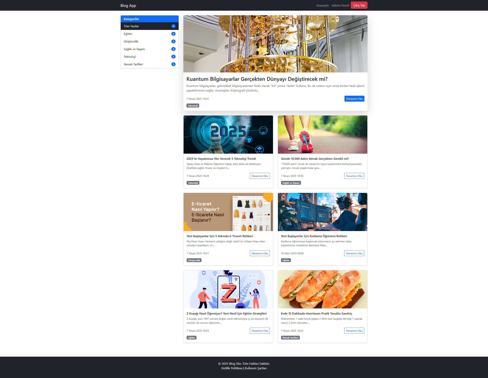
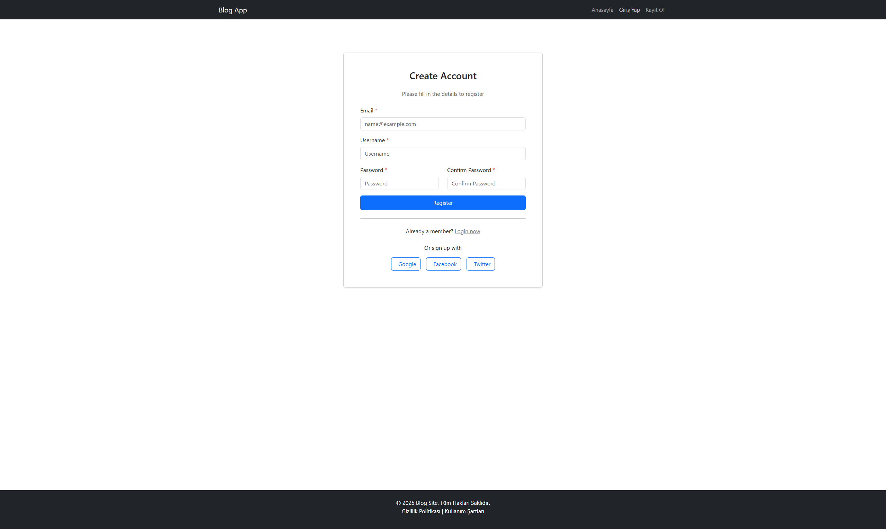
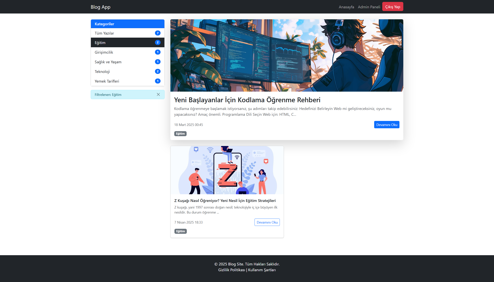
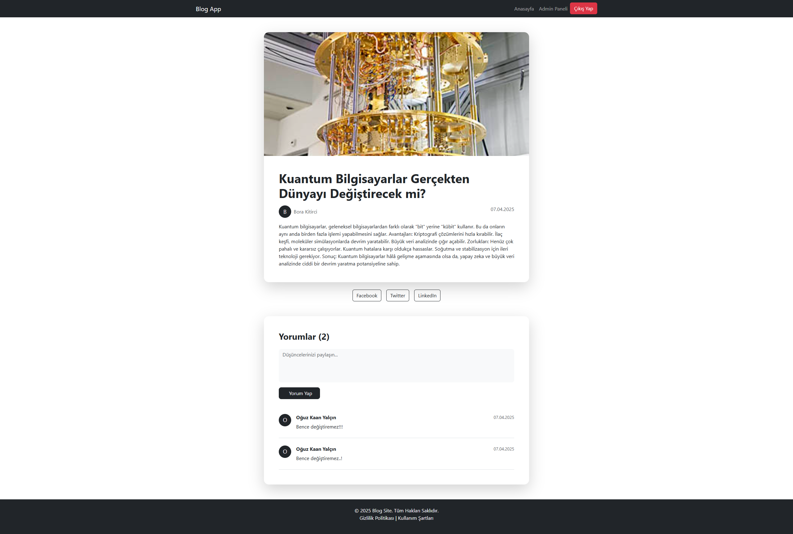
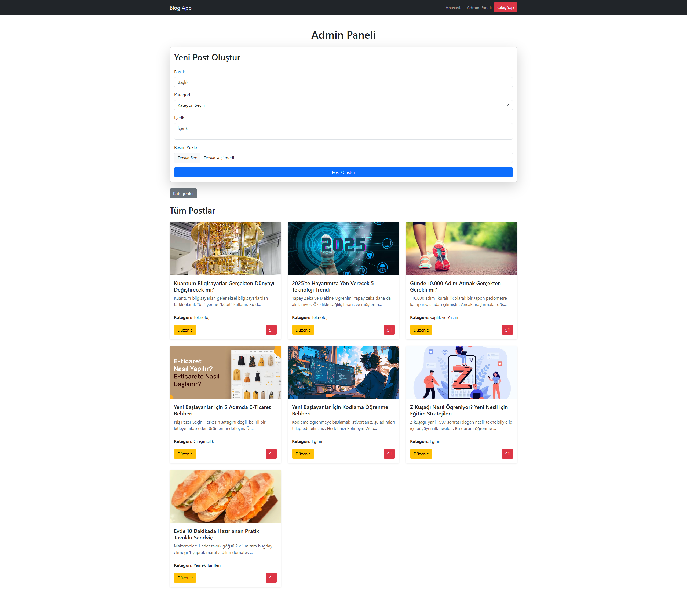

# Modern Blog Platformu 🚀



React ve Node.js ile geliştirilmiş, modern ve kullanıcı dostu bir blog platformu.

## ✨ Özellikler

### 👥 Kullanıcılar İçin
- **Responsive Tasarım**: Mobil, tablet ve masaüstü uyumlu
- **Kullanıcı Girişi**: Güvenli kayıt ve giriş sistemi
- **Kategori Filtreleme**: Kolay kategori bazlı içerik filtreleme
- **Yorumlar**: Gerçek zamanlı yorum sistemi
- **Zengin İçerik**: Metin ve görsel desteği
- **Sosyal Medya**: Entegre paylaşım butonları

### 👨‍💼 Yöneticiler İçin
- **Yönetim Paneli**: Özel admin kontrol paneli
- **İçerik Yönetimi**: Yazı ekleme, düzenleme ve silme
- **Kategori Yönetimi**: Kategorileri yönetme
- **Kullanıcı Yönetimi**: Kullanıcı yetkilerini kontrol
- **Medya Yönetimi**: Görsel yükleme ve düzenleme

## 🛠️ Kullanılan Teknolojiler

### Frontend
- **React.js**: Arayüz geliştirme
- **React Router**: Sayfa yönlendirme
- **Bootstrap**: Stil ve bileşenler
- **Axios**: API istekleri
- **Context API**: Durum yönetimi

### Backend
- **Node.js**: Sunucu ortamı
- **Express.js**: Web framework
- **PostgreSQL**: Veritabanı
- **JWT**: Kimlik doğrulama
- **Multer**: Dosya yükleme
- **bcrypt**: Şifre hashleme

## 📦 Kurulum

1. Projeyi klonlayın:
```bash
git clone https://github.com/borakitirci/Blogapp
```

2. Backend bağımlılıklarını yükleyin:
```bash
cd backend
npm install
```

3. Frontend bağımlılıklarını yükleyin:
```bash
cd frontend
npm install
```

4. Ortam değişkenlerini ayarlayın:
```bash
# backend/.env
JWT_SECRET=gizli_anahtariniz
PORT=5000

# PostgreSQL Ayarları
DB_USER=postgres
DB_HOST=localhost
DB_NAME=blog
DB_PASSWORD=sifreniz
DB_PORT=5432
```

5. Uygulamayı başlatın:
```bash
# Backend
cd backend
npm start

# Frontend
cd frontend
npm start
```

## 📱 Ekran Görüntüleri








## 🔗 API Endpointleri

### Yazılar
- `GET /api/posts` - Tüm yazıları getir
- `GET /api/posts/:id` - Belirli bir yazıyı getir
- `POST /api/posts` - Yeni yazı ekle
- `PUT /api/posts/:id` - Yazı güncelle
- `DELETE /api/posts/:id` - Yazı sil

### Kategoriler
- `GET /api/categories` - Tüm kategorileri getir
- `POST /api/categories` - Kategori ekle
- `DELETE /api/categories/:id` - Kategori sil

### Yorumlar
- `GET /api/comments/:postId` - Yazının yorumlarını getir
- `POST /api/comments` - Yorum ekle
- `PUT /api/comments/:id` - Yorum güncelle

### Kimlik Doğrulama
- `POST /api/register` - Yeni kullanıcı kaydı
- `POST /api/login` - Kullanıcı girişi
- `POST /api/validate-token` - Token doğrulama

## 🤝 Katkıda Bulunma

1. Projeyi forklayın
2. Feature branch oluşturun (`git checkout -b feature/YeniOzellik`)
3. Değişikliklerinizi commit edin (`git commit -m 'Yeni özellik eklendi'`)
4. Branch'i push edin (`git push origin feature/YeniOzellik`)
5. Pull Request oluşturun

## 📄 Lisans

Bu proje MIT lisansı altında lisanslanmıştır - detaylar için [LICENSE.md](LICENSE.md) dosyasına bakın

## 👥 Geliştiriciler

- [Oğuz Kaan Yalçın](https://github.com/oguzkaanyalcin)
- [Bora Kitirci](https://github.com/borakitirci)

## 🙏 Teşekkürler

- Bootstrap ekibine harika UI bileşenleri için
- React topluluğuna mükemmel dokümantasyon için
- Node.js topluluğuna güçlü backend ekosistemi için